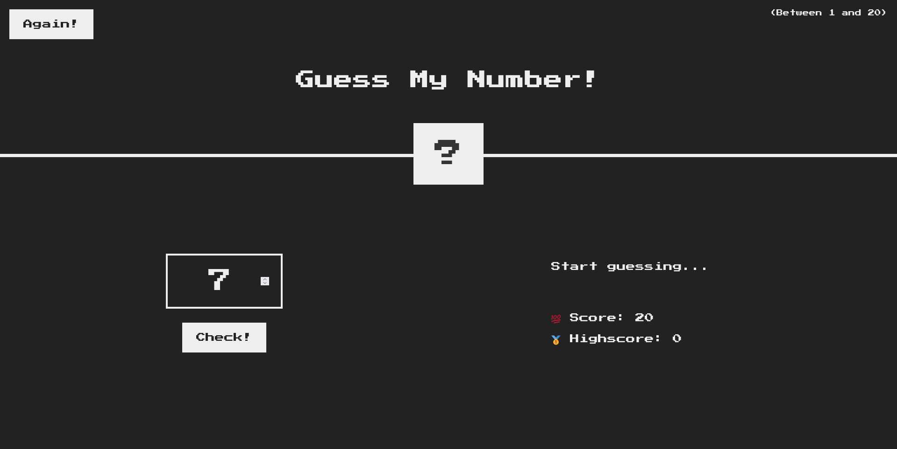

# "Guess My Number" Game

These are my notes from studying [Jonas Schmedtmann's "The Complete JavaScript Course 2022: From Zero to Expert!" Udemy course](https://www.udemy.com/course/the-complete-javascript-course/).

## Table of contents

- [Overview](#overview)
  - [The challenge](#the-challenge)
  - [Screenshots](#screenshots)
  - [Links](#links)
- [My process](#my-process)
  - [Built with](#built-with)
  - [What I learned](#what-i-learned)
- [Author](#author)
- [Acknowledgments](#acknowledgments)

## Overview

### The challenge

Jonas taught us how to build a simple JavaScript game. He introduced some simple DOM manipulation examples and went from there. After explaining and teaching how the game is programmed, he challenged us to implement a "reset" function. The idea was to reset all the values (except the High Score) to their initial state.

The code herein contained is the same as what Jonas implemented during class. What's different about it is that I made the game responsive.

### Screenshots




### Links

- Live Site URL: [https://guesssmynumber.netlify.app/](https://guesssmynumber.netlify.app/)

## My process

### Built with

- Semantic HTML5 markup
- CSS custom properties
- Flexbox
- CSS Grid
- Vanilla JavaScript

### What I learned

I'm glad that my solution was close to the final result.

```js
document.querySelector('.again').addEventListener('click', function () {
  document.querySelector('.message').textContent = 'Start guessing...';
  document.querySelector('.score').textContent = '20';
  document.querySelector('body').style.backgroundColor = '#222';
  document.querySelector('.number').style.width = '15rem';
  document.querySelector('.guess').value = '';
});
```

## Author

- Twitter - [@mexwebdev2121](https://www.twitter.com/mexwebdev2121)

## Acknowledgments

All this is thanks to Jonas Schmedtmann's[@jonasschmedtman](https://twitter.com/jonasschmedtman) [Jonas Schmedtmann's "The Complete JavaScript Course 2022: From Zero to Expert!" Udemy course](https://www.udemy.com/course/the-complete-javascript-course/).

He's a great teacher!
